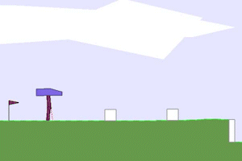

# TD3-FORK-BC

I implemented the TD-FORK algorithm with the addition of behaviour cloning for my 3rd-year Reinforcement Learning coursework.

## Results
The bipedal walker achived a high score of 322 at the 800th episode in the basic (BipedalWalker-v3) environment provided by OpenAI Gym:

The bipedal walker achived a high score of 305 at the 1300th episode in the hardcore (BipedalWalkerHardcore-v3) environment provided by OpenAI Gym:

Restrictions: max environment step count had to be set to 200

## Paper
Read my paper [here](./agent-paper.pdf).